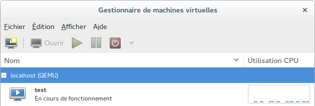

### Virtualisation

## QEMU KVM

### Machine virtuelle avec QEMU

### Création du disque virtuel

```bash
$ qemu-img create -f raw ./virtdisk/vdisk.img 4G
Formatting 'vdisk.img', fmt=raw size=4294967296 
```

- **-f raw**: format du disque , raw, qcow2, vmdk
- **vdisk.img**: nom du fichier contenant les données du disque
- **4G**: taille du disque

### Installation du la machine virtuelle

```bash
# kvm -hda ./virtdisk/vdisk.img -cdrom ~/virtualisation/isos/ubuntu-20.04-netboot.iso -boot d -m 512 -k fr-ch
```

- *-hda ./virtdisk/vdisk.img*: disque système
- *-cdrom ~/virtualisation/isos/ubuntu-20.04-netboot.iso*: [iso d’installation(mini.iso)](http://archive.ubuntu.com/ubuntu/dists/focal-updates/main/installer-amd64/current/legacy-images/netboot/)
- *-boot d*: boot sur le cdrom
- *-m 512*: 512Mo ram
- *-k fr-ch*: langage de clavier

### Exécution du la machine virtuelle

```bash
$ kvm -hda ./virtdisk/vdisk.img -m 512 -k fr-ch -daemonize
```

### Visualisation des processus

```bash
jeanbourquj@MC0-0315-JJU:~/virtualisation$ ps -ef | grep kvm
jeanbou+   94195    1845 84 13:16 ?        00:00:20 qemu-system-x86_64 -enable-kvm -hda ./virtdisk/vdisk.img -m 512 -k fr-ch -daemonize
root       94200       2  0 13:16 ?        00:00:00 [kvm-nx-lpage-re]
root       94203       2  0 13:16 ?        00:00:00 [kvm-pit/94195]
jeanbou+   94228   90680  0 13:17 pts/0    00:00:00 grep --color=auto kvm

```

### Envoyer des combinaisons de touches <CTRL><ALT><F1>

- https://askubuntu.com/questions/54814/how-can-i-ctrl-alt-f-to-get-to-a-tty-in-a-qemu-session

```bash
<CTRL><ALT><2>

(qemu) sendkey ctrl-alt-f1

<CTRL><ALT><1>
```

## LIBVIRT KVM

## Définition

> **libvirt** est une bibliothèque, une API, un daemon et des outils en logiciel libre de gestion de la virtualisation. Elle est notamment utilisée par KVM, Xen, VMware ESX, QEMU et d’autres solutions de virtualisation. Elle est notamment utilisée par la couche d’orchestration des hyperviseurs.[[9](https://fr.wikipedia.org/wiki/Libvirt)]

## Installation

### Installation de paquets

- pour ubuntu 20.04

```
$ sudo apt-get install libvirt-daemon libvirt-clients virtinst virt-viewer virt-manager
```

- pour ubuntu 18.04

```
$ sudo apt-get install libvirt-bin  virtinst virt-viewer virt-manager
```

### Ajout du groupe `libvirt` aux utilisateurs

- Ajout du groupe `libvirt` à l’utilisateur courant

```bash
$ sudo adduser $USER libvirt
```

> L’utilisateur « ubuntu » appartient déjà au groupe « libvirt ».
>
> ```bash
> $ id ubuntu
> uid=1000(ubuntu) gid=1000(ubuntu) groupes=1000(ubuntu),
> 4(adm),24(cdrom),27(sudo),
> 30(dip),46(plugdev),110(lpadmin),111(sambashare),113(libvirt)
> ```

- redémarrer le système

```bash
$ init 6
```

> Ouvrir une nouvelle session pour prendre en compte le nouveau groupe!
>
> Tester les commandes
>
> ```bash
> id
> ```
>
> et
>
> ```bash
> cat /etc/group | grep libvirt
> ```
>
> ou
>
> ```bash
> id $USER
> ```

- Vérification de l’installation

```bash
$ virsh -c qemu:///system list
ID Nom                  État
----------------------------------
```

## Création d’une machine virtuelle avec virt-install

```bash
$ virt-install -n vm1 -r 512 --disk path=./../virtdisk/vm1disk.img,format=raw,bus=virtio,size=4 -c ./../isos/ubuntu-20.04-netboot.iso --network network=default,model=virtio
Début d'installation...
Création du fichier de stockage vm1disk.img           | 4.0 GB     00:00     
Création du domaine ...                                 |    0 B     00:00     
WARNING  Impossible de se connecter à la console graphique : virt-viewer n'est pas 
installé. Veuillez installer le paquetage « virt-viewer ».
L'installation du domaine est en cours d'installation. Vous pouvez vous reconnecter 
à la console pour compléter le processus d'installation.
```

## accès à la console de la machine virtuelle

```bash
$ virt-viewer -c qemu:///system vm1
```

## Administration d’une machine virtuelle avec virsh

### lancer la console d’administration

```bash
$ virsh
```

> - connexion à un hôte de virtualisation distant
>
> ```bash
> $ virsh -c qemu+ssh://ubuntu@armilia.labo.dhu/system
> ubuntu@armilia.labo.dhu's password: 
> Bienvenue dans virsh, le terminal de virtualisation interactif.
> 
> Taper :  « help » pour l'aide ou « help » avec la commande
>         « quit » pour quitter
> 
> virsh # list
> ID    Nom                            État
> ----------------------------------------------------
> 2     iweb.lan.labo.dhu              en cours d'exécution
> 3     dc.lan.labo.dhu                en cours d'exécution
> 4     labodhu.projets                en cours d'exécution
> ```

## Administration d’une machine virtuelle avec virsh

### Afficher l’aide

```bash
virsh # help
```

### Liste de toutes les machines virtuelles (domaines)

```bash
virsh # list --all
 ID    Nom                            État
----------------------------------------------------
 -     vm1                           fermé
```

### Démarrer une machine virtuelle

```bash
virsh # start vm1
Domaine test démarré
virsh # list --all
 ID    Nom                            État
----------------------------------------------------
 2     vm1                           en cours d'exécution
```

### Modification de la configuration d’une machine virtuelle

```bash
virsh # edit vm1
```

### Description d’une VM

```bash
$ sudo cat /etc/libvirt/qemu/vm1.xml
dhu@mc0-0315-00-lab:~$ sudo cat /etc/libvirt/qemu/vm1.xml 
[sudo] Mot de passe de dhu : 
<!--
WARNING: THIS IS AN AUTO-GENERATED FILE. CHANGES TO IT ARE LIKELY TO BE
OVERWRITTEN AND LOST. Changes to this xml configuration should be made using:
  virsh edit vm1
or other application using the libvirt API.
-->

<domain type='kvm'>
  <name>vm1</name>
  <uuid>27ee2d39-a6f5-426d-8f07-99ccf6fe1975</uuid>
  <memory unit='KiB'>524288</memory>
  <currentMemory unit='KiB'>524288</currentMemory>
  <vcpu placement='static'>1</vcpu>
  <os>
    <type arch='x86_64' machine='pc-i440fx-xenial'>hvm</type>
    <boot dev='hd'/>
  </os>
  <features>
    <acpi/>
    <apic/>
  </features>
  <cpu mode='custom' match='exact'>
    <model fallback='allow'>Haswell</model>
  </cpu>
  <clock offset='utc'>
    <timer name='rtc' tickpolicy='catchup'/>
    <timer name='pit' tickpolicy='delay'/>
    <timer name='hpet' present='no'/>
  </clock>
  <on_poweroff>destroy</on_poweroff>
  <on_reboot>restart</on_reboot>
  <on_crash>restart</on_crash>
  <pm>
    <suspend-to-mem enabled='no'/>
    <suspend-to-disk enabled='no'/>
  </pm>
  <devices>
    <emulator>/usr/bin/kvm-spice</emulator>
    <disk type='file' device='disk'>
      <driver name='qemu' type='raw'/>
      <source file='/home/dhu/vm1disk.img'/>
      <target dev='vda' bus='virtio'/>
      <address type='pci' domain='0x0000' bus='0x00' slot='0x07' function='0x0'/>
    </disk>
    <disk type='file' device='cdrom'>
      <driver name='qemu' type='raw'/>
      <target dev='hda' bus='ide'/>
      <readonly/>
      <address type='drive' controller='0' bus='0' target='0' unit='0'/>
    </disk>
    <controller type='usb' index='0' model='ich9-ehci1'>
      <address type='pci' domain='0x0000' bus='0x00' 
              slot='0x06' function='0x7'/>
    </controller>
    <controller type='usb' index='0' model='ich9-uhci1'>
      <master startport='0'/>
      <address type='pci' domain='0x0000' bus='0x00' 
              slot='0x06' function='0x0' multifunction='on'/>
    </controller>
    <controller type='usb' index='0' model='ich9-uhci2'>
      <master startport='2'/>
      <address type='pci' domain='0x0000' bus='0x00' 
              slot='0x06' function='0x1'/>
    </controller>
    <controller type='usb' index='0' model='ich9-uhci3'>
      <master startport='4'/>
      <address type='pci' domain='0x0000' bus='0x00' 
              slot='0x06' function='0x2'/>
    </controller>
    <controller type='pci' index='0' model='pci-root'/>
    <controller type='ide' index='0'>
      <address type='pci' domain='0x0000' bus='0x00' 
              slot='0x01' function='0x1'/>
    </controller>
    <controller type='virtio-serial' index='0'>
      <address type='pci' domain='0x0000' bus='0x00' 
              slot='0x05' function='0x0'/>
    </controller>
    <interface type='network'>
      <mac address='52:54:00:c7:ae:97'/>
      <source network='default'/>
      <model type='virtio'/>
      <address type='pci' domain='0x0000' bus='0x00' 
              slot='0x03' function='0x0'/>
    </interface>
    <serial type='pty'>
      <target port='0'/>
    </serial>
    <console type='pty'>
      <target type='serial' port='0'/>
    </console>
    <channel type='spicevmc'>
      <target type='virtio' name='com.redhat.spice.0'/>
      <address type='virtio-serial' controller='0' bus='0' port='1'/>
    </channel>
    <input type='mouse' bus='ps2'/>
    <input type='keyboard' bus='ps2'/>
    <graphics type='spice' autoport='yes'>
      <image compression='off'/>
    </graphics>
    <sound model='ich6'>
      <address type='pci' domain='0x0000' bus='0x00' 
              slot='0x04' function='0x0'/>
    </sound>
    <video>
      <model type='qxl' ram='65536' vram='65536' 
              vgamem='16384' heads='1'/>
      <address type='pci' domain='0x0000' bus='0x00' 
              slot='0x02' function='0x0'/>
    </video>
    <redirdev bus='usb' type='spicevmc'>
    </redirdev>
    <redirdev bus='usb' type='spicevmc'>
    </redirdev>
    <memballoon model='virtio'>
      <address type='pci' domain='0x0000' bus='0x00' 
              slot='0x08' function='0x0'/>
    </memballoon>
  </devices>
</domain>
```

## Client d’administration graphique `virt-manager`



## Clones

#### Clone KVM --> KVM

Pour cloner une machine localement, on peut simplement utiliser `virt-clone` .

```bash
#Clone of vm1 to vm2 with file ./vm2disk.img as storage file.
jeanbourquj@MC0-0315-JJU:~/virtualisation/virtdisk$ virt-clone --original vm1 -n vm2 -f ./vm2disk.img
```

En revanche pour cloner sur une machine distante, il faut copier manuellement les fichiers sources et de configuration de la machine virtuelle.

```bash
#Copie du fichier xml de la vm
#NOTE: Modifier le fichier xml afin qu'il corresponde au besoin (modifier le nom, supprimer uuid et mac addresse, etc)
jeanbourquj@MC0-0315-JJU:~/virtualisation/vms$ virsh -c qemu:///system dumpxml vm1 > ./vm3.xml

#Copie du fichier de stockage de la vm
jeanbourquj@MC0-0315-JJU:~/virtualisation/virtdisk$ scp vm1disk.img ubuntu@hoteDistant:~/vm3disk.img

#Inscrire la machine dans virsh
jeanbourquj@MC0-0315-JJU:~/virtualisation/virtdisk$ virsh -c qemu+ssh://ubuntu@hoteDistant/system define
```

#### Clone KVM --> LVM

Pour créer un volume logique de 4 Gigabit il faut utiliser `lvcreate` .

```bash
#NOTE: Attention au manipulation en root
root@MC0-0315-JJU:/home/jeanbourquj/virtualisation/virtdisk# lvcreate -n vm3 -L 4G MC0-0315-JJU-VG
```

Ensuite pour copier les données du fichier `.img` on peut utiliser la commande `dd`

```bash
jeanbourquj@MC0-0315-JJU:~/virtualisation/virtdisk$ sudo dd if=./vm1disk.img of=/dev/MC0-0315-JJU-VG/vm3
8388608+0 enregistrements lus
8388608+0 enregistrements écrits
4294967296 octets (4.3 GB, 4.0 GiB) copiés, 252.645 s, 17.0 MB/s
```

Inscrire la nouvelle machine dans virsh: 

```bash
jeanbourquj@MC0-0315-JJU:~/virtualisation/vms$ virsh -c qemu:///system define ./vm3.xml
```

### Augmentation de la taille des stockages

##### Augmenter la taille d'un volume logique contenant une machine virtuelle

```
---- État initial
.---------------------------------.--------------.
| LV - /dev/MC0-0315-JJU-VG/vm3   | 4G           | Hote
+---------------------------------+--------------+
| /dev/vda     4GB                |              | disque Guest
+---------+-------------------------------------.+
|/dev/vda1                        | /dev/vda2    | partition
| primaire                        | étendue 3.5G |
|                                 +--------------+
|								  | /dev/vda5    |
|								  | logique 3.5G |
+-----------+----------------------------------- +
| /boot/efi | /                   .              |
`-----------+------------------------------------'

---- État final
.---------------------------------.--------------+----------.
| LV - /dev/MC0-0315-JJU-VG/vm3   | 4G           | +2G      |   Hote
+---------------------------------+--------------+----------+
| /dev/vda     4GB                |              | +2G      |   Disque Guest
+---------+-------------------------------------.+----------+
|/dev/vda1                        | /dev/vda2    | +2G		|   Partition
| primaire                        | étendue 3.5G |          |
|                                 +--------------+----------+
|								  | /dev/vda5    | +2G      | 
|								  | logique 3.5G |			|
+-----------+----------------------------------- +----------+
| /boot/efi | /                   .              |          |
`-----------+------------------------------------+----------'
```


###### Utilisation de l'espace disque par le système d'exploitation

```bash
ubuntu@vm3:~$ df -h
Sys. de fichiers Taille Utilisé Dispo Uti% Monté sur
udev               196M       0  196M   0% /dev
tmpfs               48M    732K   48M   2% /run
/dev/vda5          3.4G    2.9G  335M  90% /
tmpfs              239M       0  239M   0% /dev/shm
tmpfs              5.0M       0  5.0M   0% /run/lock
tmpfs              239M       0  239M   0% /sys/fs/cgroup
/dev/vda1          511M    4.0K  511M   1% /boot/efi
tmpfs               48M       0   48M   0% /run/user/1000
```

###### Liste des disques et partitions

```bash
ubuntu@vm3:~$ sudo fdisk -l
[sudo] Mot de passe de ubuntu : 
Disque /dev/vda : 6 GiB, 6442450944 octets, 12582912 secteurs
Unités : secteur de 1 × 512 = 512 octets
Taille de secteur (logique / physique) : 512 octets / 512 octets
taille d'E/S (minimale / optimale) : 512 octets / 512 octets
Type d'étiquette de disque : dos
Identifiant de disque : 0x910a7e6a

Périphérique Amorçage   Début     Fin Secteurs Taille Id Type
/dev/vda1    *           2048 1050623  1048576   512M  b W95 FAT32
/dev/vda2             1052670 8386559  7333890   3.5G  5 Étendue
/dev/vda5             1052672 8386559  7333888   3.5G 83 Linux

```

###### Emplacement de la swap

```bash
ubuntu@vm3:~$ swapon -s
Nom de fichier				Type		Taille	Utilisé	Priorité
/swapfile                              	file    	166480	0	-2
```

###### Utilisation de la mémoire

```bash
ubuntu@vm3:~$ free -h
              total       utilisé      libre     partagé tamp/cache   disponible
Mem:          477Mi        98Mi       199Mi       0.0Ki       179Mi       359Mi
Partition d'échange:       162Mi          0B       162Mi	
```

###### Agrandir de 2G le volume logique

Si la machine est en marche, i faut d'abord l'arrêter.

```bash
jeanbourquj@MC0-0315-JJU:~$ sudo lvresize -L +2G /dev/MC0-0315-JJU-VG/vm3
  Size of logical volume MC0-0315-JJU-VG/vm3 changed from 6.00 GiB (1536 extents) to 8.00 GiB (2048 extents).
  Logical volume MC0-0315-JJU-VG/vm3 successfully resized.
                                                   
```

```bash
jeanbourquj@MC0-0315-JJU:~/virtualisation/vms$ sudo lvs | grep vm3
  vm3  MC0-0315-JJU-VG -wi-ao----   8.00g   
```

```bash
jeanbourquj@MC0-0315-JJU:~$ sudo lvdisplay /dev/MC0-0315-JJU-VG/vm3
[sudo] Mot de passe de jeanbourquj : 
  --- Logical volume ---
  LV Path                /dev/MC0-0315-JJU-VG/vm3
  LV Name                vm3
  VG Name                MC0-0315-JJU-VG
  LV UUID                LOFaEG-6f0b-9s5Q-u31S-Aljj-ikaN-lxtsVO
  LV Write Access        read/write
  LV Creation host, time MC0-0315-JJU, 2021-03-30 11:11:24 +0200
  LV Status              available
  # open                 1
  LV Size                8.00 GiB
  Current LE             2048
  Segments               2
  Allocation             inherit
  Read ahead sectors     auto
  - currently set to     256
  Block device           253:3

```

###### Nouvel taille de disque

```bash
ubuntu@vm3:~$ sudo fdisk -l
Disque /dev/vda : 8 GiB, 8589934592 octets, 16777216 secteurs
Unités : secteur de 1 × 512 = 512 octets
Taille de secteur (logique / physique) : 512 octets / 512 octets
taille d'E/S (minimale / optimale) : 512 octets / 512 octets
Type d'étiquette de disque : dos
Identifiant de disque : 0x910a7e6a

Périphérique Amorçage   Début     Fin Secteurs Taille Id Type
/dev/vda1    *           2048 1050623  1048576   512M  b W95 FAT32
/dev/vda2             1052670 8386559  7333890   3.5G  5 Étendue
/dev/vda5             1052672 8386559  7333888   3.5G 83 Linux

```

##### Utilisation de l'outil `fdisk`

###### État du disque

```bash
ubuntu@vm3:~$ sudo fdisk /dev/vda

Bienvenue dans fdisk (util-linux 2.34).
Les modifications resteront en mémoire jusqu'à écriture.
Soyez prudent avant d'utiliser la commande d'écriture.

Commande (m pour l'aide) : p
Disque /dev/vda : 8 GiB, 8589934592 octets, 16777216 secteurs
Unités : secteur de 1 × 512 = 512 octets
Taille de secteur (logique / physique) : 512 octets / 512 octets
taille d'E/S (minimale / optimale) : 512 octets / 512 octets
Type d'étiquette de disque : dos
Identifiant de disque : 0x910a7e6a

Périphérique Amorçage   Début     Fin Secteurs Taille Id Type
/dev/vda1    *           2048 1050623  1048576   512M  b W95 FAT32
/dev/vda2             1052670 8386559  7333890   3.5G  5 Étendue
/dev/vda5             1052672 8386559  7333888   3.5G 83 Linux


```

###### Suppression de la partition étendue 2

```bash
Commande (m pour l'aide) : d
Numéro de partition (1,2,5, 5 par défaut) : 5

La partition 5 a été supprimée.

Commande (m pour l'aide) : d
Numéro de partition (1,2, 2 par défaut) : 2

La partition 2 a été supprimée.

Commande (m pour l'aide) : p
Disque /dev/vda : 6 GiB, 6442450944 octets, 12582912 secteurs
Unités : secteur de 1 × 512 = 512 octets
Taille de secteur (logique / physique) : 512 octets / 512 octets
taille d'E/S (minimale / optimale) : 512 octets / 512 octets
Type d'étiquette de disque : dos
Identifiant de disque : 0x910a7e6a

Périphérique Amorçage Début     Fin Secteurs Taille Id Type
/dev/vda1    *         2048 1050623  1048576   512M  b W95 FAT32
```

###### Recréation de la partition primaire

```bash
Commande (m pour l'aide) : n
Type de partition
   p   primaire (1 primaire, 0 étendue, 3 libre)
   e   étendue (conteneur pour partitions logiques)
Sélectionnez (p par défaut) : e
Numéro de partition (2-4, 2 par défaut) : 2
Premier secteur (1050624-12582911, 1050624 par défaut) : 
Last sector, +/-sectors or +/-size{K,M,G,T,P} (1050624-12582911, 12582911 par défaut) : 

Une nouvelle partition 2 de type « Extended » et de taille 5.5 GiB a été créée.

Commande (m pour l'aide) : n
Tout l’espace des partitions primaires est utilisé.
Ajout de la partition logique 5
Premier secteur (1052672-12582911, 1052672 par défaut) : 
Last sector, +/-sectors or +/-size{K,M,G,T,P} (1052672-12582911, 12582911 par défaut) : 

Une nouvelle partition 5 de type « Linux » et de taille 5.5 GiB a été créée.
La partition #5 contient une signature ext4.

Voulez-vous supprimer la signature ? [O]ui/[N]on : n
------------------------------------
Commande (m pour l'aide) : p

Disque /dev/vda : 6 GiB, 6442450944 octets, 12582912 secteurs
Unités : secteur de 1 × 512 = 512 octets
Taille de secteur (logique / physique) : 512 octets / 512 octets
taille d'E/S (minimale / optimale) : 512 octets / 512 octets
Type d'étiquette de disque : dos
Identifiant de disque : 0x910a7e6a

Périphérique Amorçage   Début      Fin Secteurs Taille Id Type
/dev/vda1    *           2048  1050623  1048576   512M  b W95 FAT32
/dev/vda2             1050624 12582911 11532288   5.5G  5 Étendue
/dev/vda5             1052672 12582911 11530240   5.5G 83 Linux

```

###### Ajouter un "Flag" d’amorçage

Si par hasard le flag d'amorçage avait disparut, ou que la partition recréer contenait le flag, recréer le.

Attention, si la partition est déjà flaggé, cela va retire le flag.

```bash
Commande (m pour l'aide) : a
Numéro de partition (1,2, 2 par défaut) : 1

L’indicateur d’amorçage de la partition 2 est maintenant activé.

Commande (m pour l'aide) : p
Disque /dev/vda : 6 GiB, 6442450944 octets, 12582912 secteurs
Unités : secteur de 1 × 512 = 512 octets
Taille de secteur (logique / physique) : 512 octets / 512 octets
taille d'E/S (minimale / optimale) : 512 octets / 512 octets
Type d'étiquette de disque : dos
Identifiant de disque : 0x910a7e6a

Périphérique Amorçage   Début      Fin Secteurs Taille Id Type
/dev/vda1    *           2048  1050623  1048576   512M  b W95 FAT32
/dev/vda2             1050624 12582911 11532288   5.5G  5 Étendue
/dev/vda5             1052672 12582911 11530240   5.5G 83 Linux

```

###### Écrire les modifications

```bash
Commande (m pour l'aide) : w
La table de partitions a été altérée.
Failed to add partition 2 to system: Périphérique ou ressource occupé

The kernel still uses the old partitions. The new table will be used at the next reboot. 
Synchronisation des disques.

```

###### Augmentation de la taille du système de fichier EXT

```bash
ubuntu@vm3:~$ df -h
Sys. de fichiers Taille Utilisé Dispo Uti% Monté sur
udev               196M       0  196M   0% /dev
tmpfs               48M    752K   48M   2% /run
/dev/vda5          3.4G    2.9G  365M  89% /
tmpfs              239M       0  239M   0% /dev/shm
tmpfs              5.0M       0  5.0M   0% /run/lock
tmpfs              239M       0  239M   0% /sys/fs/cgroup
/dev/vda1          511M    4.0K  511M   1% /boot/efi
tmpfs               48M       0   48M   0% /run/user/1000

ubuntu@vm3:~$ sudo resize2fs /dev/vda5
resize2fs 1.45.5 (07-Jan-2020)
Le système de fichiers de /dev/vda5 est monté sur / ; le changement de taille doit être effectué en ligne
old_desc_blocks = 1, new_desc_blocks = 1
Le système de fichiers sur /dev/vda5 a maintenant une taille de 1441280 blocs (4k).

ubuntu@vm3:~$ df -h
Sys. de fichiers Taille Utilisé Dispo Uti% Monté sur
udev               196M       0  196M   0% /dev
tmpfs               48M    752K   48M   2% /run
/dev/vda5          5.4G    2.9G  2.3G  56% /
tmpfs              239M       0  239M   0% /dev/shm
tmpfs              5.0M       0  5.0M   0% /run/lock
tmpfs              239M       0  239M   0% /sys/fs/cgroup
/dev/vda1          511M    4.0K  511M   1% /boot/efi
tmpfs               48M       0   48M   0% /run/user/1000

```

##### Augmenter la taille d'une machine virtuelle utilisant lvm

